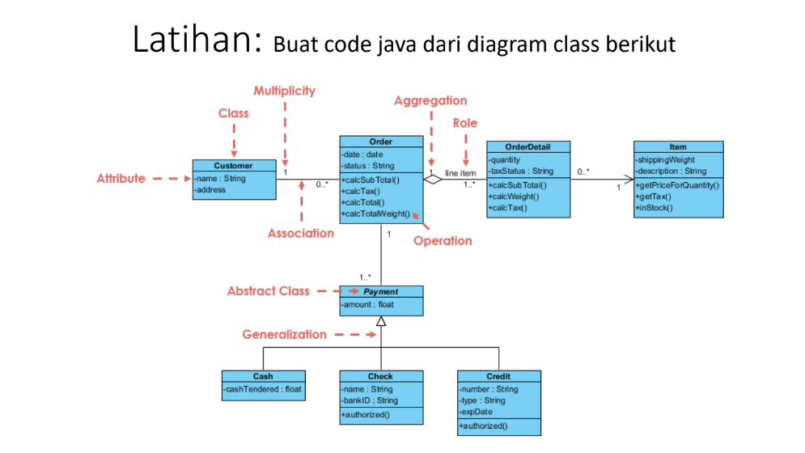
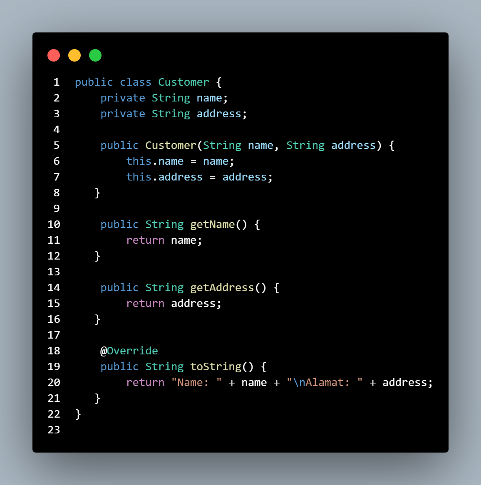
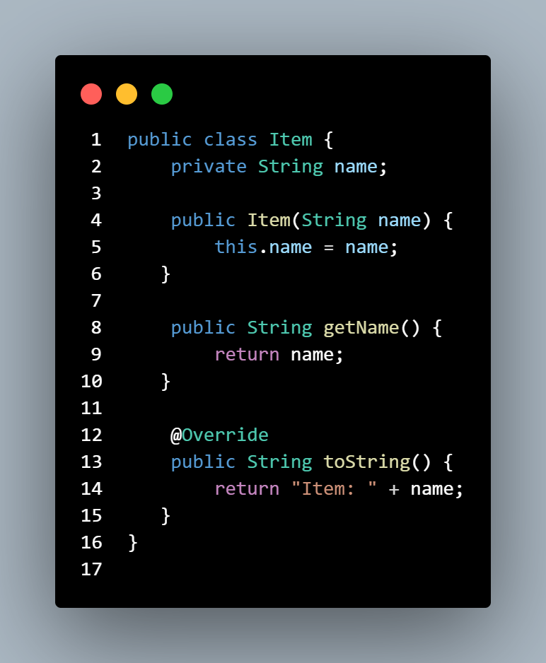
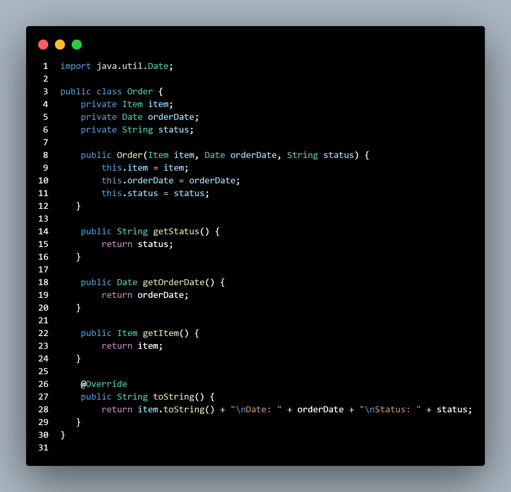

## Cardinality Class
| Pertemuan 11  |  Pemrograman Berorientasi Objek  
|-------|---------
| NIM   | 312310576
| Nama  | Taufik Hidayat
| Kelas | TI.23.A6

## Latihan

## Penjelasan

### 1. Customer Class

- Tujuan :

Untuk menyimpan dan menampilkan data pelanggan, seperti nama dan alamat.

- Atribut :

name: Menyimpan nama pelanggan.

address: Menyimpan alamat pelanggan.

- Metode:

getName() dan getAddress() digunakan untuk mengambil nilai dari atribut name dan address.

toString(): Mengembalikan string yang mewakili informasi pelanggan dalam format yang diinginkan (Nama dan Alamat).
### 2. Item Class

- Tujuan:

Menyimpan dan menampilkan data item yang dipesan oleh pelanggan.

- Atribut:

name: Menyimpan nama item (misalnya, "Laptop").

- Metode:

getName(): Mengambil nama item.

toString(): Mengembalikan string yang mewakili item, yaitu nama item yang dipesan.

### 3. Order Class

- Tujuan:

Menyimpan informasi terkait pesanan yang dilakukan oleh pelanggan.

- Atribut:

item: Merujuk ke objek Item yang dipesan.

orderDate: Menyimpan tanggal pesanan dilakukan.

status: Menyimpan status pesanan (misalnya, "Online").

- Metode:

getItem(), getOrderDate(), dan getStatus(): Mengambil informasi item, tanggal pesanan, dan status pesanan.

toString(): Mengembalikan string yang mewakili informasi pesanan, termasuk item yang dipesan, tanggal pesanan, dan status pesanan.
4. Payment (Abstract Class)
Tujuan: Sebagai kelas abstrak yang mendefinisikan pembayaran umum. Kelas ini memiliki atribut amount yang digunakan oleh kelas turunannya (Cash, Check, Credit).
Atribut:
amount: Menyimpan jumlah uang yang dibayarkan.
Metode:
getAmount(): Mengambil jumlah pembayaran.
toString(): Mengembalikan representasi umum dari pembayaran.
5. Cash Class
Tujuan: Merupakan turunan dari kelas Payment yang mengimplementasikan pembayaran dengan uang tunai.
Metode:
toString(): Mengembalikan format pembayaran tunai dengan nilai jumlah uang yang dibayarkan.
6. Check Class
Tujuan: Merupakan turunan dari kelas Payment yang mengimplementasikan pembayaran dengan cek.
Atribut:
bankId: Menyimpan informasi Bank ID terkait dengan pembayaran cek.
Metode:
toString(): Mengembalikan format pembayaran cek, dengan mencetak BankID terkait.
7. Credit Class
Tujuan: Merupakan turunan dari kelas Payment yang mengimplementasikan pembayaran dengan kartu kredit.
Atribut:
expirationDate: Menyimpan tanggal kedaluwarsa kartu kredit.
Metode:
toString(): Mengembalikan format pembayaran dengan kartu kredit yang mencetak tanggal kedaluwarsa.
Main Class
Tujuan: Merupakan kelas utama yang digunakan untuk menjalankan aplikasi, membuat objek-objek yang diperlukan, dan menampilkan output sesuai dengan format yang diminta.
Proses:
Membuat objek Customer untuk pelanggan bernama "Taufik" dengan alamat "Sukatani - Cikarang".
Membuat objek Item untuk item yang dipesan, dalam hal ini adalah "Laptop".
Membuat objek Order yang mengaitkan item dengan tanggal pesanan dan status "Online".
Membuat tiga objek pembayaran (Cash, Check, dan Credit) untuk mewakili pembayaran yang dilakukan oleh pelanggan.
Menampilkan informasi yang diinginkan sesuai format yang diminta, seperti nama pelanggan, item yang dipesan, tanggal pesanan, status pesanan, dan detail pembayaran.
Output
Output yang dihasilkan oleh aplikasi menunjukkan informasi pelanggan, pesanan, dan pembayaran dalam format yang jelas dan sesuai dengan yang diminta:
